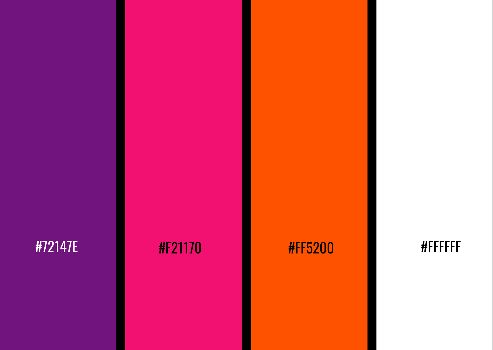

## Coders Evoke

Coders Evoke is all about sharing knowledge, posting achievements, participating in hackathons, discussions and much more!
We have a wide variety of topics however we’re always open to suggestions from the community.

We have come up with an initiative of developing a website for the community as an open-source project to help others get started with open source.

The redesigning of the website has already started. You can find the UI mockups in the Issues section. Refer to the issue and make sure the webpage or part of webpage is **Fully Responsive**.

<h3 align="center">
    <a href="https://discord.gg/FZusE7FH4q">👋 join our discord community <strong>Coders Evoke</strong> </a>
    </h3>

## Contributing to this Repo

**1.** Fork [this](https://github.com/Coders-Evoke-Community/CodersEvoke_website/fork) repository.

**2.** Clone the forked repository.

```bash
git clone https://github.com/<your-github-username>/project_name.git
```

**3.** Navigate to the project directory.

```bash
cd CodersEvoke_website
```

**4.** Creating a new branch (IMP)
This is one of the very important step that you should follow to contribute in Open Source. A branch helps to manage the workflow, isolate your code and does not creates a mess. To create a new branch:

```bash
$ git branch <name_of_branch>
$ git checkout -b <name_of_branch>
```

Keep your cloned repo upto date by pulling from upstream (this will also avoid any merge conflicts while committing new changes)

```bash
git pull origin main
```

**5.** Make changes in source code.

**6.** Stage your changes and commit

```bash
# Add changes to Index
git add .

# Commit to the local repo
git commit -m "<your_commit_message>"
```

**7.** At this point you can use the git push command to push the changes to the current branch of your forked repository:

```bash
git push origin <branch-name>
```

**8.** Create a [Pull Request/PR](https://help.github.com/en/github/collaborating-with-issues-and-pull-requests/creating-a-pull-request) !

**9.** **Congratulations!** Sit and relax, you've made your contribution to CodersEvoke Website.

**Note** :

- If no response is recieved from you within 7 days of assigning the issue, then the issue will be unassigned.
- If an issue doesn't gets assignee within 7 days, it will get assigned to the maintainer of repository

## Do you Want to Contribute to this repository?

Head over to [Contributing Guidelines](https://github.com/Coders-Evoke-Community/CodersEvoke_website/blob/main/CONTRIBUTION.md) to know more!

<hr>

## **Repository Structure**

```
├───.github
│   ├───ISSUE_TEMPLATE
│   └───workflows
├───assets
│   ├───css                    #All CSS files
│   └───images                 #All Images
├───js                         #All JS Files
└───Pages                      #All HTML Files
```

<p align="center"><b>Color Scheme for website</b></p>

<p align="center">

</p>

---

<h1 align=center> Project Admin ❤️ </h1>
<p align="center">

<table align="center">
    <tbody>
        <tr>
            <td align="center"><a href="https://github.com/Ayan-thecodeking"><br><sub><b> Ayan Gupta </b></sub></a></td>
            <td align="right">
                <p><a href="https://twitter.com/CodeXayan_?s=09"></a></p>
                <p><a href="https://www.linkedin.com/in/ayan-gupta-🇮🇳-924833201/"></a></p>
            </td>
        </tr>
    </tbody>
</table>

---

<!-- <h1 align=center> Mentors ✨</h1>
<p align="center">

<table align="center">
    <tbody>
        <tr>
            <td align="center"><a href="https://github.com/neelshah2409"><br><sub><b> Neel Shah </b></sub></a></td>
            <td align="right">
                <p><a href="https://www.linkedin.com/in/neel-shah-07460218a/"></a></p>
            </td>
            <td align="center"><a href="https://github.com/abhiisinghh7"><br><sub><b> Abhijat Singh </b></sub></a></td>
            <td align="right">
                <p><a href="https://www.linkedin.com/in/abhiisinghh99/"></a></p>
            </td>
        </tr>
    </tbody>
</table> -->

### Credit goes to these people:✨

<table>
	<tr>
		<td>
			<a href="https://github.com/Coders-Evoke-Community/CodersEvoke_website/graphs/contributors">
  
</a>
		</td>
	</tr>
</table>

</br>
</br>

## License


<hr>

<h3 align="center">
    If you  are a beginner and looking to contribute, then you can refer <a href="https://github.com/Ayan-thecodeking/Here-Contributions-Begins.git">CONTRIBUTION.MD </a> </h3>

</br>
</br>

<h1 align=center>Happy Coding 👨‍💻 </h1>
